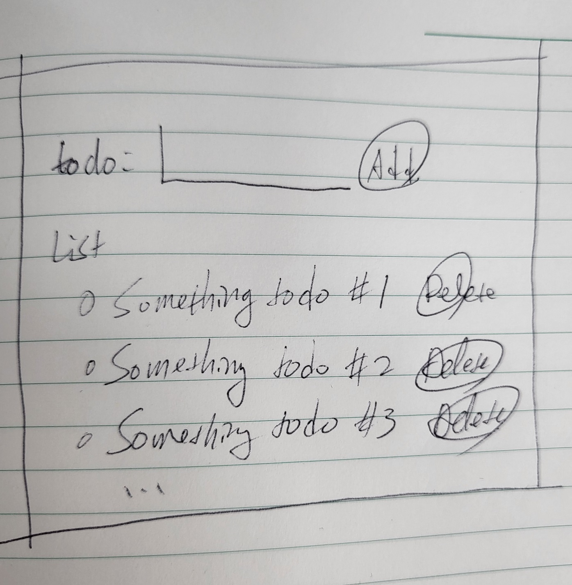

# Todo Webapp

## UI Sketch


## Scaffolding
```
$ node -v
v16.20.0

$ npm init vue@latest

Vue.js - The Progressive JavaScript Framework

✔ Project name: … todo
✔ Add TypeScript? … No
✔ Add JSX Support? … No
✔ Add Vue Router for Single Page Application development? … No
✔ Add Pinia for state management? … Yes
✔ Add Vitest for Unit Testing? … Yes
✔ Add an End-to-End Testing Solution? › No
✔ Add ESLint for code quality? … No

Scaffolding project in /home/ingee/work/todo/todo...

Done. Now run:

  cd todo
  npm install
  npm run dev

```
